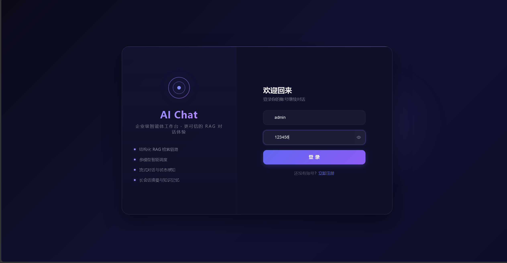
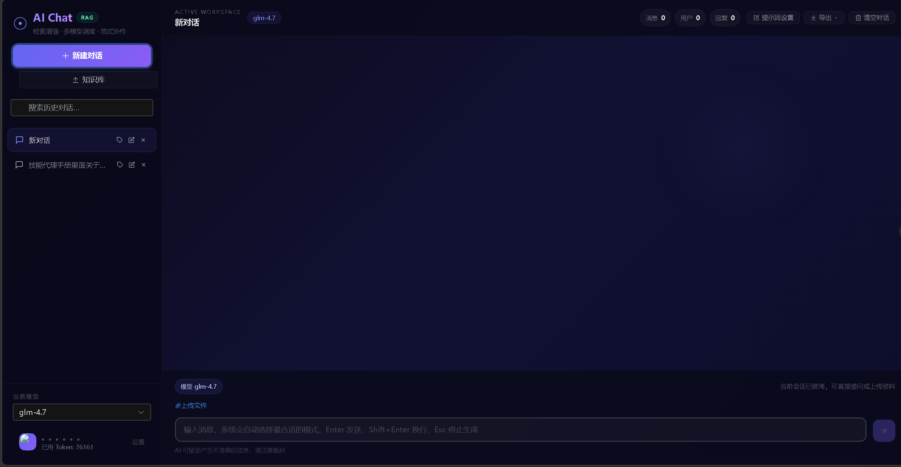
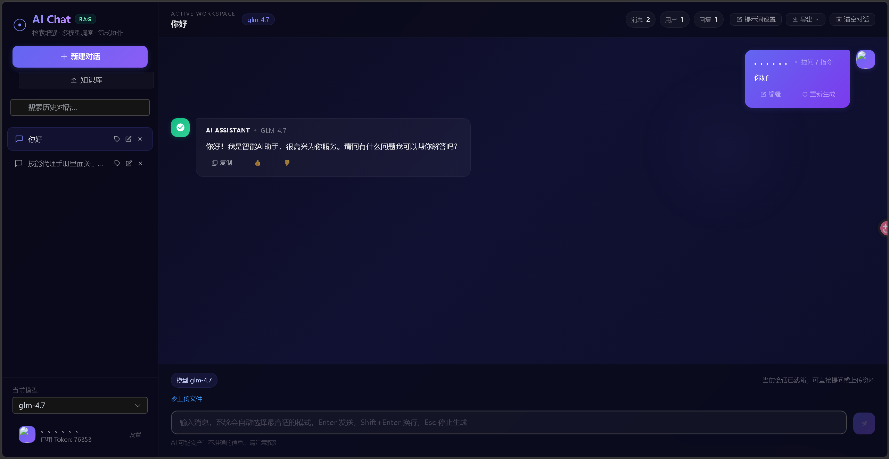

# AI Chat Agent — 智能 AI 助手平台

基于 Spring Boot 3 + Vue 3 的企业级 AI 对话平台，支持多模型流式对话（SSE）、RAG 检索增强生成、Function Calling 工具调用。

---

## 目录

- [第一步：安装 Docker](#第一步安装-docker)
- [第二步：克隆项目](#第二步克隆项目)
- [第三步：构建项目](#第三步构建项目)
- [第四步：填写配置](#第四步填写配置)
- [第五步：启动服务](#第五步启动服务)
- [第六步：验证部署](#第六步验证部署)
- [常见问题](#常见问题)
- [配置参考](#配置参考)
- [开发环境](#开发环境)
- [项目架构](#项目架构)

---

## 第一步：安装 Docker

整个项目的数据库、Redis、后端、前端全部用 Docker 运行。你**不需要**单独安装 MySQL、Redis、JDK、Maven 或 Nginx——只需要一个 Docker。

### Windows

1. 下载 Docker Desktop：[https://www.docker.com/products/docker-desktop/](https://www.docker.com/products/docker-desktop/)
2. 安装时勾选 **"Use WSL 2 instead of Hyper-V"**（默认已勾选）
3. 安装完成后重启电脑
4. 启动 Docker Desktop，任务栏右下角图标变绿即就绪
5. 打开 PowerShell 验证：
   ```
   docker --version
   docker compose version
   ```
   两条命令都输出版本号即可。

### macOS

1. 下载 Docker Desktop：[https://www.docker.com/products/docker-desktop/](https://www.docker.com/products/docker-desktop/)
   - Apple Silicon（M1/M2/M3）→ 选 **Apple Chip**
   - Intel 芯片 → 选 **Intel Chip**
2. 把 Docker.app 拖进 Applications，双击启动
3. 终端验证：
   ```
   docker --version
   docker compose version
   ```

### Linux（Ubuntu / Debian / CentOS）

```bash
# Docker 官方安装脚本（适用于所有主流发行版）
curl -fsSL https://get.docker.com | bash

# 启动并设为开机自启
sudo systemctl enable docker
sudo systemctl start docker

# 验证
docker --version
docker compose version
```

> **国内服务器强烈建议配置镜像加速**，否则拉取镜像会很慢。编辑 `/etc/docker/daemon.json`（没有就新建）：
> ```json
> {
>   "registry-mirrors": [
>     "https://mirror.ccs.tencentyun.com",
>     "https://docker.m.daocloud.io"
>   ]
> }
> ```
> 保存后执行 `sudo systemctl restart docker`。

### 阿里云服务器

推荐用阿里云**轻量应用服务器**，性价比高：

1. [https://swas.console.aliyun.com/](https://swas.console.aliyun.com/) → 创建实例
2. 镜像选 **"系统镜像 → Ubuntu 24.04"**
3. 最低 2 核 2G 即可，约 68 元/月
4. 购买后 SSH 登录，执行上面 Linux 的安装命令

---

## 第二步：克隆项目

```bash
git clone <本项目地址>
cd Agent
```

克隆后看到的目录结构：

```
Agent/
├── docker-compose.yml          # Docker 编排
├── Dockerfile                  # 后端镜像构建
├── .env.example                # 环境变量模板
├── README.md
├── pom.xml                     # Maven 配置
├── sql/
│   └── init.sql.example        # 数据库初始化模板
├── deploy/
│   └── nginx-docker.conf       # Nginx 配置
├── frontend/                   # Vue 3 前端源码
│   └── src/
└── src/                        # Spring Boot 后端源码
    └── main/
```

> 克隆后**没有** `target/*.jar`、`frontend/dist/`、`.env`、`sql/init.sql`，这些需要下面几步手动构建和创建。

---

## 第三步：构建项目

### 3.1 安装构建工具

构建前端需要 **Node.js 18+**：

- 下载地址：[https://nodejs.org/](https://nodejs.org/) → 选 LTS 版本，一路安装即可
- Linux 快速安装：`curl -fsSL https://deb.nodesource.com/setup_20.x | sudo -E bash - && sudo apt install -y nodejs`

构建后端需要 **JDK 17+** 和 **Maven 3.8+**：

- JDK 17：[https://adoptium.net/download/](https://adoptium.net/download/) → 选 Temurin 17，按系统下载安装
- Maven：[https://maven.apache.org/download.cgi](https://maven.apache.org/download.cgi) → 下载 Binary zip，解压后把 `bin/` 目录加到系统 PATH 环境变量

验证安装：

```bash
node --version    # 应输出 v18.x 或以上
npm --version     # 应输出 9.x 或以上
java --version    # 应输出 17.x
mvn --version     # 应输出 3.8.x 或以上
```

> 如果在服务器上构建不方便，也可以在自己电脑上构建好，然后把 `target/*.jar` 和 `frontend/dist/` 上传到服务器。

### 3.2 构建前端

```bash
cd frontend

# 安装依赖（只需首次执行）
npm install

# 构建（输出到 dist/ 目录）
npm run build

cd ..
```

### 3.3 构建后端

```bash
# 在项目根目录执行，跳过测试加快速度
mvn clean package -DskipTests
```

构建完成后会生成 `target/Agent-0.0.1-SNAPSHOT.jar`。

---

## 第四步：填写配置

### 4.1 创建 .env 文件

```bash
cp .env.example .env
```

用任意文本编辑器打开 `.env`，逐条修改：

```bash
# MySQL root 密码（自己随便设）
MYSQL_PASSWORD=123456

# Redis 密码（自己随便设）
REDIS_PASSWORD=123456

# JWT 签名密钥（随便填一串就行）
JWT_SECRET=my-super-secret-jwt-key-please-change

# 智谱 API Key（去 https://open.bigmodel.cn/ 注册免费获取）
ZHIPU_API_KEY=填你的智谱Key

# 用户 Key 加密密钥（随便填一串，用于加密用户自备的 DeepSeek Key）
APP_API_KEY_SECRET=my-encryption-secret-please-change

# 前端地址（把 IP 换成你服务器的）
CORS_ORIGINS=http://你的服务器IP:82
```

> **智谱 API Key 怎么获取？**
>
> 1. 打开 [https://open.bigmodel.cn/](https://open.bigmodel.cn/) 注册账号
> 2. 登录后进入控制台 → API Keys
> 3. 复制 Key 填入 `.env` 和下面的 `init.sql`

### 4.2 创建数据库初始化脚本

```bash
cp sql/init.sql.example sql/init.sql
```

编辑 `sql/init.sql`，找到包含 `glm-4.7`、`glm-4.6v`、`glm-4.5-air` 的 3 行 INSERT 语句，把 `${ZHIPU_API_KEY}` 替换为你的智谱 API Key：

```sql
-- 替换前（模板）
INSERT INTO `model_config` VALUES (1, 'glm-4.7', '${ZHIPU_API_KEY}', 'https://open.bigmodel.cn/...', 1, 0, ...);
INSERT INTO `model_config` VALUES (2, 'glm-4.6v', '${ZHIPU_API_KEY}', 'https://open.bigmodel.cn/...', 1, 1, ...);
INSERT INTO `model_config` VALUES (3, 'glm-4.5-air', '${ZHIPU_API_KEY}', 'https://open.bigmodel.cn/...', 1, 0, ...);

-- 替换后（把 3 个 ${ZHIPU_API_KEY} 都改成你的真实 Key）
INSERT INTO `model_config` VALUES (1, 'glm-4.7', '你的真实Key', 'https://open.bigmodel.cn/...', 1, 0, ...);
INSERT INTO `model_config` VALUES (2, 'glm-4.6v', '你的真实Key', 'https://open.bigmodel.cn/...', 1, 1, ...);
INSERT INTO `model_config` VALUES (3, 'glm-4.5-air', '你的真实Key', 'https://open.bigmodel.cn/...', 1, 0, ...);
```

> 3 行都要替换，否则 GLM 模型无法使用。DeepSeek 和 OpenAI 那两行不需要改，它们由用户在前端填写自己的 Key。

---

## 第五步：启动服务

```bash
# 启动所有服务（首次会自动拉取镜像，需要几分钟）
docker compose up -d

# 查看容器状态，4 个都应该是 Up
docker compose ps
```

正常输出：

```
NAME             STATUS
ai-chat-mysql    Up (healthy)
ai-chat-redis    Up (healthy)
ai-chat-app      Up
ai-chat-nginx    Up
```

`mysql` 和 `redis` 显示 `(healthy)` 说明健康检查通过。`app` 启动需要一两分钟（初始化数据库连接），如果显示 `Up` 就是正常的。

### 常用运维命令

```bash
docker compose ps              # 查看容器状态
docker compose logs -f         # 实时查看所有日志，Ctrl+C 退出
docker compose logs -f app     # 只看后端日志
docker compose restart app     # 重启后端（改了配置后执行）
docker compose down            # 停止所有服务
docker compose up -d           # 重新启动
docker compose down -v         # 停止并删除所有数据，慎用！
```

### 开放端口

在云服务器控制台的安全组/防火墙中放行 **82 端口**：

- **阿里云**：控制台 → 安全组 → 添加规则 → 入方向 → TCP 82 → 授权对象 0.0.0.0/0
- **腾讯云**：控制台 → 防火墙 → 添加规则 → TCP 82
- **本地电脑**：无需额外操作

> 3306、6379、8083 是容器间内部通信端口，**不需要对外开放**。

---

## 第六步：验证部署

### 1. 检查前端

浏览器打开 `http://你的服务器IP:82`，看到登录/注册页面即为正常。

### 2. 注册并测试对话

1. 点击"注册"，填写用户名和密码
2. 登录后进入聊天页
3. 左下角模型选择框选 `glm-4.5-air`
4. 发送："你好，请做个自我介绍"
5. 确认收到逐字输出的流式回复

### 3. 测试 DeepSeek 模型

1. 点击右上角头像 → 个人设置
2. 在 API Key 处填入你的 DeepSeek Key（`sk-` 开头，从 [https://platform.deepseek.com/](https://platform.deepseek.com/) 获取）
3. 对话页切换模型为 `deepseek`
4. 正常对话

### 4. 测试知识库上传

1. 左侧菜单点击"知识库"
2. 上传一个 PDF 或文档
3. 回到对话页，提问文件相关内容
4. AI 能结合文件内容回答

---

## 常见问题

| 问题 | 原因 | 解决 |
|------|------|------|
| 页面打不开 | 安全组未放行 82 端口 | 去云控制台添加 TCP 82 入站规则 |
| 注册/登录报错 | MySQL 初始化未完成 | `docker compose logs mysql` 查看日志 |
| 发送消息一直转圈 | GLM API Key 配错了 | 检查 `.env` 和 `sql/init.sql` 中的 Key |
| 知识库上传失败 | Redis 不是 Stack 版本 | 确认用的是 `redis/redis-stack-server` 镜像 |
| `docker compose` 命令不存在 | Docker 版本太老 | 升级 Docker，或改用 `docker-compose`（带横杠） |
| 容器不断重启 | 端口冲突 | `docker compose logs app` 看报错；改 `docker-compose.yml` 中 ports 左边数字 |
| 拉镜像很慢 | 国内网络问题 | 参考第一步配置镜像加速器 |

---

## 配置参考

### 模型列表

| 模型 | API Key 来源 | 说明 |
|------|-------------|------|
| `glm-4.7` | 服务端配置 | 智谱最新旗舰 |
| `glm-4.6v` | 服务端配置 | 支持图片识别 |
| `glm-4.5-air` | 服务端配置 | 轻量快速 |
| `deepseek` | 用户自备 | 在前端个人设置填写 |
| `openai` | 用户自备 | 同上 |

### 环境变量

| 变量 | 必填 | 说明 |
|------|------|------|
| `MYSQL_PASSWORD` | 是 | MySQL root 密码 |
| `REDIS_PASSWORD` | 是 | Redis 密码 |
| `JWT_SECRET` | 是 | JWT 签名密钥 |
| `ZHIPU_API_KEY` | 是 | 智谱 API Key |
| `APP_API_KEY_SECRET` | 是 | 用户 Key 加密密钥 |
| `CORS_ORIGINS` | 是 | 前端地址，如 `http://你的服务器IP:82` |

### 端口映射

| 服务 | 宿主机端口 | 说明 |
|------|-----------|------|
| Nginx（前端） | 82 | 浏览器访问 |
| Spring Boot | 8083 | 后端 API |
| MySQL | 3306 | 数据库 |
| Redis Stack | 6379 | 缓存与向量存储 |

> 端口冲突时，修改 `docker-compose.yml` 中 `ports` 冒号**左边**的数字。

### 数据存储

数据保存在 Docker Volume 中，容器删除不影响数据：

| Volume | 存储内容 |
|--------|---------|
| `mysql_data` | 用户、会话、消息 |
| `redis_data` | 向量索引、缓存 |
| `uploads_data` | 头像文件 |

---

## 开发环境

如果需要本地开发调试：

### 1. 启动基础设施

```bash
docker compose up -d mysql redis
```

### 2. 配置 IDE 环境变量

在运行配置中添加：

```
MYSQL_HOST=localhost;MYSQL_USER=root;MYSQL_PASSWORD=你设的密码;REDIS_HOST=localhost;REDIS_PASSWORD=你设的密码;JWT_SECRET=dev-secret;ZHIPU_API_KEY=你的Key;APP_API_KEY_SECRET=dev-encrypt-key!!;CORS_ORIGINS=http://localhost:5173
```

### 3. 启动后端

```bash
mvn spring-boot:run
```

### 4. 启动前端

```bash
cd frontend
npm install
npm run dev
```

访问 `http://localhost:5173`。

---a

## 项目架构

```
+-------------------+      +------------------+      +-------------------+
|  Vue 3 前端       | <--> |  Spring Boot API | <--> | LLM API (GLM/DS) |
+-------------------+      +------------------+      +-------------------+
                                   |   |
                    +--------------+   +--------------+
                    |                                 |
           +------------------+              +-----------------+
           |   RAG Engine     |              |  Tool Registry  |
           | (Redis Vector)   |              | (Function Call) |
           +------------------+              +-----------------+
```

| 层级 | 技术 |
|------|------|
| 后端框架 | Spring Boot 3.2.5 |
| AI 框架 | Spring AI 1.0.0-M1 |
| 数据库 | MySQL 8.0 + MyBatis-Plus |
| 缓存 / 向量库 | Redis Stack（RediSearch + RedisJSON） |
| HTTP 客户端 | OkHttp3 + SSE |
| Token 计算 | JTokkit |
| 文档解析 | Apache Tika |
| 前端 | Vue 3 + TypeScript + Element Plus + Vite |






